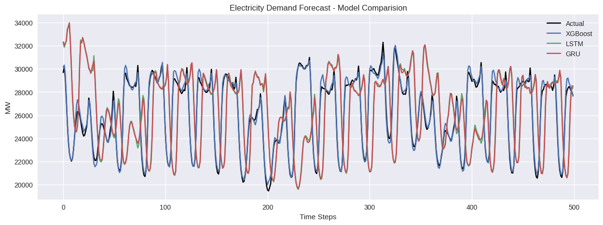

# Electricity Demand Forecasting using Machine Learning & Deep Learning

## Project Overview
This project focuses on forecasting **hourly electricity demand** using historical load data.  
It compares traditional machine learning and deep learning approaches to capture both
short-term fluctuations and long-term temporal dependencies.

The models implemented include:
- XGBoost (tree-based ML)
- LSTM (Long Short-Term Memory)
- GRU (Gated Recurrent Unit)

---

## Dataset
- **Source**: PJM Interconnection hourly electricity demand
- **Time Period**: 2002 – 2018
- **Frequency**: Hourly
- **Target Variable**: Electricity load (MW)

---

## Methodology

### 1. Data Preprocessing
- Converted datetime column to time index
- Resampled data to strict hourly frequency
- Handled missing values using time-based interpolation

### 2. Feature Engineering (for XGBoost)
- Calendar features: hour, day of week, month, weekend
- Lag features: 1, 24, 48, 168 hours
- Rolling statistics: 24-hour mean and standard deviation

### 3. Deep Learning Preparation
- Standardized electricity load
- Created sliding window sequences (24-hour window)
- Time-based train–test split (80–20)

---

## Models Used

| Model     | Description |
|----------|------------|
| XGBoost  | Gradient-boosted decision trees using lag-based features |
| LSTM     | Recurrent neural network capturing long-term dependencies |
| GRU      | Efficient RNN variant with fewer parameters |

---

## Model Performance

| Model   | MAE (MW) | RMSE (MW) |
|--------|---------|-----------|
| XGBoost | 358.46 | 476.22 |
| LSTM    | 229.54 | 330.94 |
| GRU     | **224.01** | **311.68** |

**GRU achieved the best overall performance**, indicating strong ability to model
complex temporal patterns in electricity demand.

---

## Results Visualization
The figure below compares actual demand with predictions from all three models:

---

## Tech Stack
- Python
- NumPy, Pandas, Matplotlib
- Scikit-learn
- XGBoost
- TensorFlow / Keras

---

## Key Takeaways
- Deep learning models outperform traditional ML for sequential electricity demand data
- GRU provides a strong balance between accuracy and computational efficiency
- Sequence-based modeling captures sharp demand fluctuations better than lag features alone

---

## Future Work
- Multi-step forecasting
- Inclusion of weather and temperature variables
- Hyperparameter tuning and probabilistic forecasting
- Deployment as a real-time forecasting API

---

## Author
**Chirag Sadhwani**  
